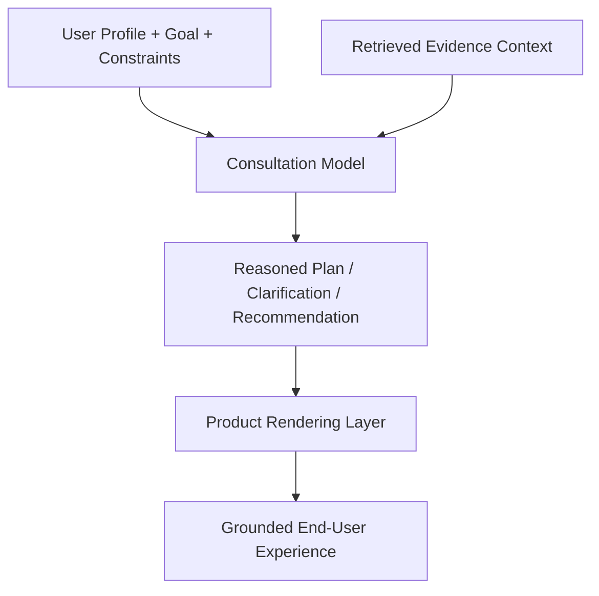
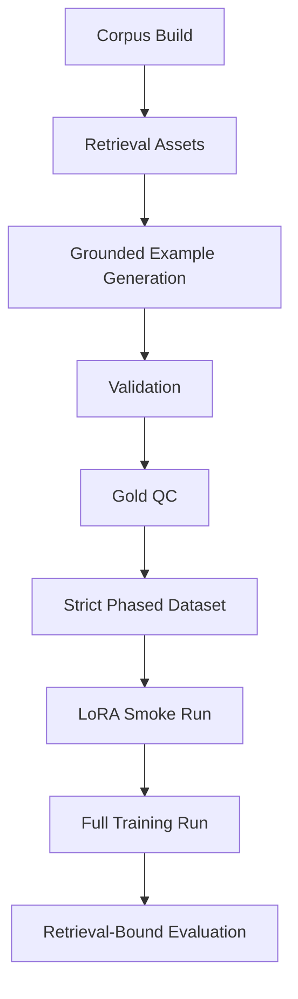
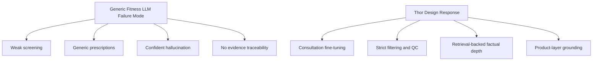

# Thor

<div align="center">

## Evidence-Grounded Intelligence For Exercise, Nutrition, And Screening-Aware Coaching

**Thor is a domain-specialized LLM system for building an evidence-aware exercise physiology and sports nutrition assistant that reasons under constraints, screens before prescribing, and scales through retrieval rather than brittle memorization.**

</div>

---

## Executive Summary

Thor is not a generic fitness chatbot.

It is a full-stack training and inference system designed to produce a much narrower, more defensible behavior profile:

- ask the right questions before making recommendations
- adapt plans to injury, pain, recovery, and user constraints
- rely on curated evidence pipelines instead of style-heavy prompting
- combine fine-tuned consultation behavior with retrieval-backed factual depth
- preserve a modular product path for citations, UX, and future evidence refresh

The core thesis is simple:

**The highest-value domain LLMs will not be the ones that memorize the most. They will be the ones that separate behavior, evidence, and product orchestration cleanly.**

---

## Why This Matters

The typical failure mode in consumer-facing fitness AI is not lack of fluency. It is lack of discipline.

Most systems fail because they:

- prescribe before screening
- give generic plans independent of user context
- mix low-trust and high-trust knowledge without control
- hide weak reasoning behind confident language
- couple product quality to weight memorization alone

Thor is built against that entire pattern.

It is designed for a different standard:

- **behaviorally aligned**: consultation flow is trained explicitly
- **evidence-grounded**: factual depth comes from retrieval assets, not wishful memorization
- **screening-aware**: the assistant is trained to gather constraints before planning
- **capital efficient**: phased LoRA runs, smoke tests, and same-instance Docker reuse reduce waste
- **product ready**: the architecture already anticipates citations, evidence cards, and retrieval-backed responses

---

## Product Thesis

Thor targets a category with real product leverage:

- high-frequency user questions
- high variability in user goals and limitations
- strong demand for personalization
- meaningful value from evidence-backed reasoning
- obvious gaps in current generic LLM performance

In product terms, Thor is building toward:

1. a consultation-grade reasoning engine
2. a retrieval-backed evidence substrate
3. a user-facing guidance layer that can explain, constrain, and eventually cite recommendations clearly

This is a stronger long-term position than training a single model and hoping it remains current, safe, and specific across expanding use cases.

---

## System Architecture

Thor uses a three-layer architecture.


### 1. Consultation Model

The fine-tuned model is optimized for **decision behavior**, not encyclopedic recall.

It is trained to:

- collect missing context before planning
- perform lightweight screening
- reason with user constraints in view
- adapt recommendations rather than emit templates
- explain tradeoffs in clear language

### 2. Retrieval Layer

The retrieval layer is optimized for **factual precision and extensibility**.

It is responsible for:

- surfacing relevant evidence per user scenario
- reducing hallucination on detailed claims
- carrying factual density beyond what should live in the weights
- allowing the system to grow without retraining on every corpus update

### 3. Product Layer

The product layer is optimized for **trust and usability**.

It handles:

- response rendering
- future citation UX
- source presentation
- interaction constraints
- evidence-linked user experiences beyond raw model output



---

## What Is Technically Distinctive

Thor is opinionated in ways that matter.

### Fine-Tuning Is Not Treated As The Knowledge Store

The model is tuned for:

- consultation behavior
- safety-aware interaction patterns
- screening logic
- planning structure
- domain-specific reasoning style

The model is **not** asked to memorize the entire knowledge base.

That design choice improves:

- maintainability
- refreshability
- evaluation clarity
- cost efficiency

### Retrieval Is A First-Class System Component

Thor treats retrieval as part of the architecture, not an afterthought.

That means:

- evidence preparation is explicit
- chunking and embeddings are persistent assets
- retrieval is part of the intended product path
- future evidence refresh does not require retraining by default

### Training Is Curriculum-Shaped

Thor avoids the common mistake of collapsing all synthetic and derived data into one monolithic SFT mixture.

Instead, it uses staged trust levels:

- broad legacy sets for reference and ablation
- grounded generation outputs for candidate supervision
- validation and rewrite stages for structure control
- strict gold-QC datasets for paid training runs

This is a cleaner research and engineering posture than “more rows = better model.”

---

## Data Filtering Strategy

Thor is built around **signal extraction**, not just corpus acquisition.

The filtering pipeline is one of the main intellectual assets of the repo.


### Normalization First

Heterogeneous sources are normalized into a common schema before they influence retrieval or SFT.

This creates a stable substrate for:

- domain tagging
- record typing
- metadata tracking
- grounding retention
- downstream filtering

### Deduplication Before Embeddings

Thor removes repeated or near-repeated evidence before retrieval preparation.

That reduces:

- repetition bias
- embedding waste
- artificial source overweighting
- low-value duplication in supervised training assets

### Evidence And Dialogue Are Kept Separate

A critical design rule in Thor is:

**raw evidence is not chat data**

That separation gives cleaner system boundaries between:

- evidence corpus
- retrieval chunks
- grounded synthetic supervision
- final strict SFT sets

### Grounded Generation Before Final SFT

Thor does not feed scraped source text directly into conversational fine-tuning.

Instead, it uses the evidence layer to produce training examples shaped around the actual downstream task:

- asking
- screening
- adapting
- constraining
- explaining

That is a far better match to the target product than naive corpus-to-chat transformation.

### Gold QC Gates

Candidate rows do not become training rows automatically.

They are filtered into explicit buckets such as:

- keep
- needs rewrite
- reject

Only the highest-trust rows make it into strict phased training.

---

## Training Strategy

Thor uses a capital-efficient, research-friendly training loop.



### Key Training Decisions

- LoRA over heavyweight full-model retraining
- strict phased data before broad scaling
- smoke tests before expensive runs
- Dockerized GPU path for reproducibility
- same-instance EC2 reuse to avoid unnecessary image rebuild waste
- retrieval-bound evaluation as the real target condition

### Why This Is Smart

This approach is:

- cheaper to iterate
- easier to debug
- easier to audit
- less vulnerable to data drift
- more aligned with how the end product will actually run

---

## Purpose-Built For Constrained Guidance

Thor is not trying to be a universal health model.

It is aiming for a narrower, more useful behavior profile:

- exercise physiology coaching
- sports nutrition guidance
- screening-aware adaptation
- evidence-grounded planning
- user-specific reasoning under real constraints

That is the correct scope for a model meant to be practically useful and operationally maintainable.

---

## Current Workflow

### Build The Evidence Layer

```bash
bash scripts/run_raw_collection_wsl.sh
source .venv/bin/activate
python scripts/normalize_evidence_corpus.py
python scripts/prepare_ingestion_corpus.py
python scripts/embed_evidence_chunks.py --batch-size 128
```

### Run A Strict Fine-Tuning Pass

```bash
bash scripts/train_qwenf1_phase12_docker.sh
```

### Reuse The Same EC2 Instance Efficiently

```bash
HOST=<ec2-public-dns> bash scripts/sync_thor_repo_to_ec2_wsl.sh
HOST=<ec2-public-dns> bash scripts/thor_ec2_ssh_wsl.sh bash /home/ubuntu/scripts/remote_phase12_start.sh
```

---

## Visual Logic




---

## Repository Structure

```text
configs/        query plans, seed controls, and generation settings
data/           staged training assets and corpus derivatives
docs/           architecture, methodology, training, and runbooks
schemas/        normalized record and SFT schemas
scripts/        collection, normalization, retrieval, QC, training, EC2 ops
```

Highest-value areas:

- `scripts/` for the actual system mechanics
- `docs/` for architectural and methodological framing
- `data/sft/final/` for phased final supervised datasets
- `Dockerfile.unsloth` and `docker-compose.unsloth.yml` for reproducible GPU execution

---

## Status

Thor already contains:

- a multi-stage evidence pipeline
- retrieval-ready corpus preparation
- grounded example generation
- validation and gold-QC tooling
- phased strict SFT datasets
- repeatable Docker training
- EC2 runbooks and automation
- a validated same-instance strict smoke run using LoRA + Unsloth

That means the project is beyond “idea stage.”

The remaining work is not to make it look like an AI system.

The remaining work is to keep sharpening the strict consultation data, continue high-discipline fine-tuning, and bind the model tightly to retrieval-backed product behavior.

---

## Bottom Line

Thor is an attempt to build the right kind of vertical LLM system:

- narrow enough to be reliable
- structured enough to be maintainable
- evidence-aware enough to be defensible
- efficient enough to iterate quickly
- product-shaped enough to matter

If generic LLMs are broad but shallow for this category, Thor is designed to be narrower and much deeper where it counts.
