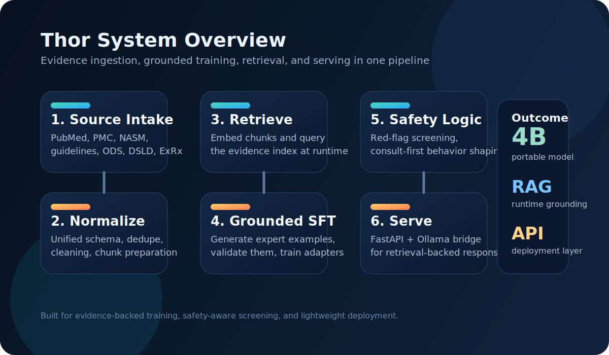
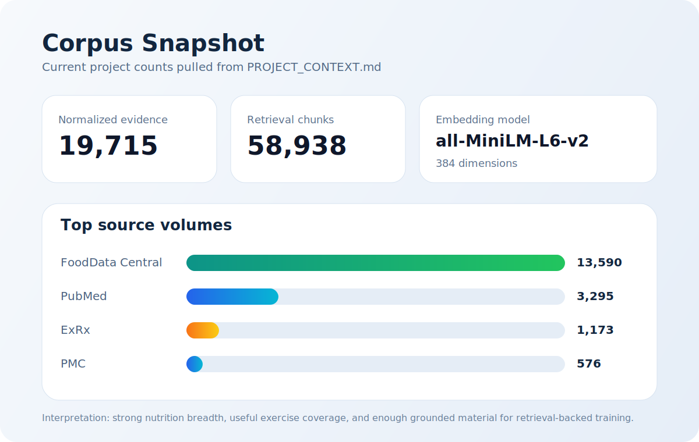
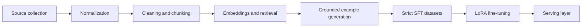

# Thor

Thor is an evidence-grounded health and exercise reasoning stack built around a fine-tuned `Qwen` model, a curated expert corpus, retrieval, and a lightweight serving layer.

It is designed to answer performance, training, and screening-oriented questions with better grounding than a generic fitness chatbot.



## What this repo contains

- A normalized evidence corpus built from guideline, literature, and exercise reference sources
- Retrieval infrastructure for chunking, embedding, and evidence lookup
- Grounded example generation and curation scripts for supervised fine-tuning
- Training and export scripts for local, WSL, Docker, and EC2 workflows
- A small FastAPI app for retrieval-backed inference

## Current corpus snapshot

The project context currently reports:

- `19,715` normalized evidence records
- `19,063` cleaned retrieval records
- `58,938` retrieval chunks
- `58,938` embedding vectors
- `384` embedding dimensions with `sentence-transformers/all-MiniLM-L6-v2`



## Architecture



## API quickstart

Install the runtime dependencies:

```bash
pip install -r requirements.txt
```

Run the local API:

```bash
python app.py
```

Health check:

```bash
curl http://localhost:8000/health
```

Ask a question:

```bash
curl -X POST http://localhost:8000/ask \
  -H "Content-Type: application/json" \
  -d "{\"query\":\"I am training for a marathon and have missed my period for three months. What should I do first?\",\"top_k\":5}"
```

The API retrieves supporting evidence, constructs a grounded prompt, and forwards it to the configured Ollama backend.

## Important paths

- `app.py`: FastAPI entrypoint for retrieval-backed inference
- `scripts/normalize_evidence_corpus.py`: normalization pipeline
- `scripts/retrieve_evidence.py`: retrieval utility
- `scripts/embed_evidence_chunks.py`: embedding pipeline
- `scripts/generate_grounded_examples.py`: grounded example synthesis
- `scripts/evaluate_qwenf1_adapter.py`: adapter evaluation workflow
- `docs/llamaparse_ingestion.md`: LlamaParse enrichment workflow
- `PROJECT_CONTEXT.md`: persistent project state and current counts

## Notes

- `.env` is intentionally ignored and should remain local
- `outputs/` contains model artifacts and run outputs and is not meant for GitHub
- the research paper draft is intentionally excluded from the push scope
